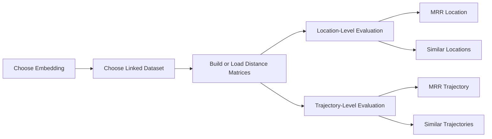
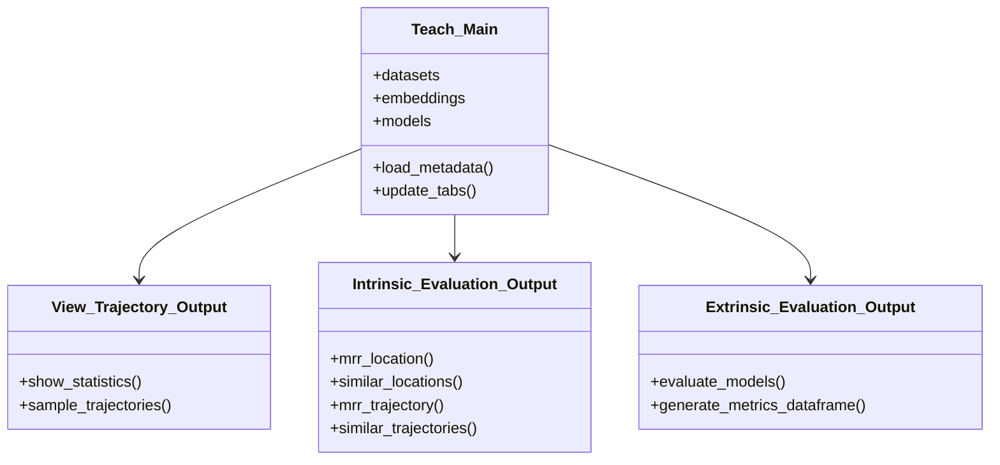

# TEACH - Trajectory Embedding Comparator Benchmark

<p>
  
  
  
  
  
  
  
  
  
  
  
  
</p>

**TEACH** stands for **Trajectory Embedding compArator benCHmark**.

This repository provides an interactive benchmark tool for comparing **trajectory embedding representations** before using them in downstream machine learning models.

The problem of selecting the most appropriate trajectory embedding is challenging because the representation quality can strongly influence the global performance of prediction models. TEACH helps researchers inspect, compare, and evaluate embeddings through both **intrinsic** and **extrinsic** evaluation strategies.

The project is inspired by the paper:

> 📄 [**Modeling Trajectories Obtained from External Sensors for Location Prediction via NLP Approaches**](https://www.mdpi.com/1424-8220/22/19/7475)

---

## 📌 Overview

TEACH is designed to support researchers working with trajectory data, location prediction, and representation learning.

The tool provides a visual and interactive workflow for:

```text
uploading trajectory datasets
uploading trajectory embedding files
uploading trained prediction models
linking datasets, embeddings, and models
visualizing trajectory samples
computing dataset statistics
performing intrinsic embedding evaluation
performing extrinsic model evaluation
comparing embeddings before neural model usage
```

The main motivation comes from an analogy with Natural Language Processing. In NLP, word embeddings are often evaluated before being used in downstream models. TEACH adapts this idea to **trajectory embeddings**, where locations, sensors, or trajectory tokens can be represented as vectors.

---

## 🧭 Conceptual Map

```mermaid
graph TD
    teach_root["TEACH"] --> data_layer["Trajectory Data"]
    teach_root --> emb_layer["Embedding Representations"]
    teach_root --> model_layer["Prediction Models"]
    teach_root --> eval_layer["Evaluation Strategies"]
    teach_root --> dashboard_layer["Interactive Dashboard"]

    data_layer --> latlon_data["Lat/Lon Trajectories"]
    data_layer --> sequence_data["Sequence Trajectories"]
    data_layer --> road_network["Road Network Context"]

    emb_layer --> token_table["Tokenization Table"]
    emb_layer --> emb_matrix["Embedding Matrix"]
    emb_layer --> trajectory_vectors["Trajectory Vectors"]

    model_layer --> h5_models["Keras .h5 Models"]
    model_layer --> next_location["Next Location Prediction"]

    eval_layer --> intrinsic_eval["Intrinsic Evaluation"]
    eval_layer --> extrinsic_eval["Extrinsic Evaluation"]

    intrinsic_eval --> mrr_location["MRR Location"]
    intrinsic_eval --> similar_locations["Similar Locations"]
    intrinsic_eval --> mrr_trajectory["MRR Trajectory"]
    intrinsic_eval --> similar_trajectories["Similar Trajectories"]

    extrinsic_eval --> accuracy_metrics["Accuracy Metrics"]
    extrinsic_eval --> f1_score["F1-Score"]
    extrinsic_eval --> model_comparison["Model Comparison"]

    dashboard_layer --> upload_tab["Upload Tab"]
    dashboard_layer --> view_tab["View Trajectory Data"]
    dashboard_layer --> intrinsic_tab["Intrinsic Evaluation Tab"]
    dashboard_layer --> extrinsic_tab["Extrinsic Evaluation Tab"]
```



---

## 🧠 NLP Inspiration: From Word Embeddings to Trajectory Embeddings

<p align="center">
  
</p>

<p align="center">
  <em>Word embedding vector-space analogy. TEACH adapts the idea of comparing semantic vector representations to the mobility domain, where locations, sensors, or trajectory tokens are represented as embeddings.</em>
</p>

In NLP, an embedding maps a discrete token to a continuous vector.

For example:

```text
word -> vector
location token -> vector
trajectory sequence -> vector representation
```

TEACH follows the same conceptual direction, but instead of comparing words, it compares representations of trajectory-related elements.

This allows researchers to ask questions such as:

```text
Do nearby locations have similar embedding vectors?
Do trajectories with similar routes become close in embedding space?
Does a better intrinsic representation improve downstream prediction?
Which embedding should be coupled with a neural network model?
```

---

## 🗺️ Trajectory Data Context

<p align="center">
  
</p>

<p align="center">
  <em>Example of GPS track visualization. TEACH focuses on trajectory data represented either as latitude/longitude points or as symbolic sequences of locations.</em>
</p>

A trajectory can be represented as an ordered sequence:

$$
T = \langle p_1, p_2, \ldots, p_n \rangle
$$

where each point may contain:

```text
time
latitude
longitude
trajectory_id
optional location_label
```

In a sequence-based representation, the same trajectory can also be modeled as:

$$
T = \langle l_1, l_2, \ldots, l_n \rangle
$$

where each $l_i$ is a location token, road segment, sensor identifier, or discretized spatial label.

---

## ✅ Main Usage per Script

| Script | Main Role | Libraries |
|---|---|---|
| `app/dashboards_classes/view_trajectory_data.py` | Dataset statistics and trajectory visualization. | Pandas, NumPy, IPython, IPyWidgets, PyMove, Folium, OS, Pathlib, Random |
| `app/dashboards_classes/extrinsic_evaluation.py` | Evaluation of trained models on location prediction tasks. | Pandas, NumPy, scikit-learn, Keras, IPython, IPyWidgets, Pathlib |
| `app/dashboards_classes/intrinsic_evaluation.py` | Embedding quality inspection through distance matrices, MRR, and similarity analysis. | Pandas, NumPy, PyMove, OSMnx, NetworkX, Matplotlib, NLTK, TQDM, Pathlib, OS, Copy |
| `app/dashboards_classes/teach_main.py` | Main dashboard orchestration class. | Pandas, NumPy, IPython, IPyWidgets, Keras, OS, Pathlib, IO, Copy |
| `app/utils/distances.py` | Distance functions used by intrinsic comparison routines. | Math, NumPy |
| `app/utils/geographical.py` | Geographical and sequence utilities. | Keras Preprocessing |
| `app/utils/metrics.py` | Evaluation metrics. | NumPy |
| `app/utils/output.py` | Output widgets and display helpers. | IPython, IPyWidgets |

---

## 📂 Repository Structure

```text
teach/
│
├── app/
│   ├── dashboards_classes/
│   │   ├── extrinsic_evaluation.py
│   │   ├── intrinsic_evaluation.py
│   │   ├── teach_main.py
│   │   └── view_trajectory_data.py
│   │
│   ├── utils/
│   │   ├── distances.py
│   │   ├── geographical.py
│   │   ├── metrics.py
│   │   └── output.py
│   │
│   ├── matrices/
│   ├── trajectories/
│   ├── trejectories/
│   └── teach.ipynb
│
├── Basic_User_Experience_Flow.png
├── TEACH_Class_Diagram.png
├── README.md
└── requirements.txt
```

Depending on the execution flow, TEACH may also create or update metadata files such as:

```text
Emb.csv
Model.csv
Emb#Data.csv
Model#Data.csv
Model#Emb.csv
```

---

## 🧠 Dependencies & Libraries

TEACH combines scientific Python, geospatial processing, machine learning, visualization, and dashboard tools.

| Tool / Library | Purpose |
|---|---|
| Python 3.8.3 | Main execution environment. |
| Pandas 1.5.3 | Tabular data loading, metadata tables, and dataframe operations. |
| NumPy 1.23.5 | Numerical operations and vector calculations. |
| Matplotlib 3.6.2 | Plotting evaluation curves and matrices. |
| scikit-learn 1.0.2 | Machine learning metrics and evaluation utilities. |
| Keras 2.9.0 | Loading and evaluating neural models. |
| TensorFlow 2.9.1 | Backend for Keras models. |
| TQDM 4.66.1 | Progress bars for long computations. |
| OSMnx 1.2.2 | Road network extraction and spatial network analysis. |
| NetworkX 2.8.5 | Graph structures and network algorithms. |
| IPyWidgets 8.0.6 | Interactive dashboard controls. |
| IPython 8.8.0 | Notebook display and output utilities. |
| PyMove 3.1.2 | Trajectory processing and visualization support. |
| NLTK 3.7 | NLP utilities. |
| Folium 0.14.0 | Interactive map visualization. |
| Keras Preprocessing 1.1.2 | Sequence padding utilities. |
| Voilà 0.5.2 | Converts the notebook into an interactive dashboard application. |

---

# ▶️ Activating TEACH

## 1. Create a Conda Environment

Create an environment named `teach_env`:

```bash
conda create -n teach_env python=3.8.3
```

Activate the environment:

```bash
conda activate teach_env
```

---

## 2. Install Dependencies

Install dashboard and mobility-related dependencies:

```bash
conda install -c conda-forge voila pymove nltk=3.7 ipython=8.8.0
```

Install TensorFlow and Matplotlib:

```bash
conda install tensorflow=2.9.1 matplotlib=3.6.2
```

Install geospatial and machine learning dependencies:

```bash
conda install -c conda-forge osmnx=1.2.2 networkx=2.8.5 scikit-learn=1.0.2
```

If needed, install remaining packages with `pip`:

```bash
pip install pandas==1.5.3 numpy==1.23.5 folium==0.14.0 ipywidgets==8.0.6 tqdm==4.66.1 keras-preprocessing==1.1.2
```

---

## 3. Clone the Repository

```bash
git clone https://github.com/InsightLab/teach.git
```

Enter the repository and application folder:

```bash
cd teach
cd app
```

---

## 4. Run the Dashboard

```bash
voila teach.ipynb
```

Voilà will serve the notebook as an interactive web application.

---

# 🧭 Basic User Experience Flow

The TEACH interface is organized as a set of tabs that guide the user through data upload, visualization, intrinsic evaluation, and extrinsic evaluation.

<p align="center">
  
</p>

<p align="center">
  <em>Basic user experience flow of the TEACH dashboard.</em>
</p>

Conceptually, the dashboard follows this flow:


---

# 🧩 TEACH Dashboard Tabs

## 1. Upload Tab

The first tab contains three main upload sections:

```text
Datasets Import
Embeddings Import
Models Import
```

These sections define the objects that will be compared across the rest of the dashboard.

---

### Datasets Import

This section uploads trajectory datasets in CSV format.

A dataset should contain at least:

```text
time
lat
lon
trajectory_id
```

Optionally, a dataset may also include:

```text
location_label
```

The dashboard allows users to:

```text
upload datasets
rename datasets
remove datasets
make datasets available to other tabs
```

Removing or renaming a dataset may affect links with embeddings and models.

---

### Embeddings Import

This section uploads embedding files in CSV format.

An embedding file should contain:

```text
a tokenization table
an embedding matrix associated with the tokens
```

Users can:

```text
upload embeddings
rename embeddings
remove embeddings
link embeddings to datasets
```

The embedding metadata is saved in:

```text
Emb.csv
```

Dataset-embedding links are saved in:

```text
Emb#Data.csv
```

---

### Models Import

This section uploads trained models in `.h5` format.

Users can:

```text
upload models
rename models
remove models
link models to datasets
```

Model metadata is saved in:

```text
Model.csv
```

Dataset-model links are saved in:

```text
Model#Data.csv
```

Model-embedding links are saved in:

```text
Model#Emb.csv
```

---

## 2. View Trajectory Data Tab

This tab helps users understand the structure of an uploaded dataset.

It includes two main functions:

```text
Show Statistics
Sampling
```

---

### Show Statistics

The statistics output may include:

```text
number_of_trajectories
maximum_length_of_trajectories
minimum_length_of_trajectories
average_length_of_trajectories
number_of_distinct_locations
```

The `number_of_distinct_locations` attribute is available when the dataset contains `location_label`.

---

### Sampling

The sampling function plots a subset of trajectories.

If the user chooses $k$ trajectories, TEACH samples and visualizes $k$ trajectories from the selected dataset.

This allows quick inspection of:

```text
trajectory distribution
spatial coverage
trajectory length variation
possible outliers
route concentration
```

---

## 3. Intrinsic Evaluation Tab

Intrinsic evaluation studies embedding quality independently of a downstream predictive task.

In TEACH, intrinsic evaluation asks whether embedding-space similarity is consistent with mobility-space similarity.

---

## Intrinsic Evaluation Workflow



---

### MRR Location

This evaluation compares distance matrices associated with each location in the trajectory dataset.

TEACH compares:

```text
Cosine Matrix
Euclidean Matrix
Road Matrix
```

The goal is to determine whether locations that are close in embedding space are also close according to geographic or road-network distance.

---

### Similar Locations

This function allows the user to select a tokenized location and visualize the most similar locations according to embedding similarity.

The comparison is usually based on cosine distance between embedding vectors.

This helps answer:

```text
Does the embedding preserve spatial proximity?
Are similar tokens located in nearby regions?
Are unexpected neighbors appearing in embedding space?
```

---

### MRR Trajectory

Trajectory-level MRR evaluates similarity between trajectory representations.

A trajectory vector can be defined as the average of the embedding vectors of its locations:

$$
\mathbf{v}_T = \frac{1}{n}\sum_{i=1}^{n}\mathbf{v}_{l_i}
$$

TEACH can compare trajectory distance matrices such as:

```text
Cosine Matrix
DTW Matrix
Edit Distance Matrix
```

---

### Similar Trajectories

This function allows the user to choose a trajectory and visualize the most similar trajectories according to embedding similarity.

This helps evaluate whether the embedding can group trajectories with similar movement patterns.

---

## Mean Reciprocal Rank

Mean Reciprocal Rank, or MRR, evaluates how highly the first relevant item appears in a ranked list.

For a set of queries $Q$:

$$
MRR = \frac{1}{|Q|}\sum_{i=1}^{|Q|}\frac{1}{rank_i}
$$

where $rank_i$ is the rank position of the first relevant result for query $i$.

Higher MRR indicates that relevant items tend to appear near the top of the ranking.

---

## 4. Extrinsic Evaluation Tab

Extrinsic evaluation compares embeddings through a downstream task.

In TEACH, the downstream task is related to location prediction.

The user selects trained models that were imported and linked to datasets.

For each selected model, TEACH loads the sequence-type trajectory dataset generated from the linked lat/lon data and evaluates predictive performance.

---

## Extrinsic Evaluation Workflow


---

## Metrics

The extrinsic evaluation output includes:

```text
three accuracy variants
F1-Score
```

The exact interpretation of each accuracy variant depends on the model and evaluation implementation.

The F1-score combines precision and recall:

$$
F_1 = 2 \cdot \frac{precision \cdot recall}{precision + recall}
$$

---

# 🧱 TEACH Architecture

The `Teach_Main` class is imported into the Jupyter Notebook and orchestrates the dashboard.

The following classes are used as components:

```text
View_Trajectory_Output
Intrinsic_Evaluation_Output
Extrinsic_Evaluation_Output
```

These classes are connected because changes in uploaded data, embeddings, or models affect multiple tabs.

<p align="center">
  
</p>

<p align="center">
  <em>TEACH class diagram showing the relationship between the main dashboard class and the output/evaluation components.</em>
</p>

---

## Architecture Flow



---

# 📐 Distance and Similarity Measures

TEACH compares embeddings and trajectories using multiple distance concepts.

## Cosine Similarity

For two vectors $\mathbf{a}$ and $\mathbf{b}$:

$$
cos(\theta) = \frac{\mathbf{a}\cdot\mathbf{b}}{\|\mathbf{a}\|\|\mathbf{b}\|}
$$

Cosine distance can be defined as:

$$
d_{cos}(\mathbf{a}, \mathbf{b}) = 1 - cos(\theta)
$$

---

## Euclidean Distance

$$
d_E(\mathbf{a}, \mathbf{b}) = \sqrt{\sum_{i=1}^{n}(a_i - b_i)^2}
$$

---

## Road Network Distance

Road distance measures how far two locations are along the road network rather than through straight-line distance.

This is useful because two locations may be geographically close but far apart by road connectivity.

---

## Dynamic Time Warping

DTW compares sequences that may have different speeds or temporal alignments.

It is useful for comparing trajectories with similar shapes but different sampling rates or movement speeds.

---

## Edit Distance

Edit distance compares sequences according to insertions, deletions, and substitutions.

For trajectory sequences, this can be used to compare symbolic movement patterns.

---

# ⏱️ Computational Complexity Notes

Let:

```text
N = number of trajectories
L = average trajectory length
M = number of unique locations or tokens
D = embedding dimension
K = number of selected models
```

| Task | Typical Time Complexity | Typical Space Complexity | Notes |
|---|---:|---:|---|
| Dataset statistics | $O(N \cdot L)$ | $O(1)$ extra | Scans trajectories and lengths. |
| Sampling trajectories | $O(K_s \cdot L)$ | $O(K_s \cdot L)$ | $K_s$ is the number of sampled trajectories. |
| Location cosine matrix | $O(M^2 \cdot D)$ | $O(M^2)$ | Pairwise vector similarity. |
| Location Euclidean matrix | $O(M^2 \cdot D)$ | $O(M^2)$ | Pairwise vector distance. |
| Road distance matrix | Depends on graph shortest paths | $O(M^2)$ | Cost depends on road network size and algorithm. |
| Trajectory vector averaging | $O(N \cdot L \cdot D)$ | $O(N \cdot D)$ | Builds trajectory embeddings by averaging token vectors. |
| Trajectory cosine matrix | $O(N^2 \cdot D)$ | $O(N^2)$ | Pairwise trajectory vector similarity. |
| DTW matrix | $O(N^2 \cdot L^2)$ | $O(N^2)$ | Pairwise sequence alignment. |
| Edit distance matrix | $O(N^2 \cdot L^2)$ | $O(N^2)$ | Pairwise symbolic sequence distance. |
| Extrinsic model evaluation | Depends on model architecture | Depends on model | Evaluates selected neural models. |

---

# 🧪 Behavior Summary

The TEACH workflow can be summarized as:

```text
1. Start the Voilà dashboard.
2. Upload trajectory datasets.
3. Upload embedding files.
4. Upload trained neural models.
5. Link datasets to embeddings and models.
6. Inspect dataset statistics and sampled trajectories.
7. Run intrinsic evaluation over locations and trajectories.
8. Run extrinsic evaluation over prediction models.
9. Compare representations and model performance.
10. Select the most appropriate trajectory embedding for future experiments.
```

---

# 🧭 Suggested Study Path

A good study order for this repository is:

```text
1. Trajectory data representation
2. Latitude/longitude trajectory format
3. Sequence trajectory format
4. Tokenization of locations
5. Word embeddings and NLP analogy
6. Trajectory embeddings
7. Cosine and Euclidean distance
8. Road-network distance
9. Dynamic Time Warping
10. Edit distance
11. Mean Reciprocal Rank
12. Intrinsic evaluation
13. Neural location prediction
14. Accuracy and F1-score
15. Extrinsic evaluation
16. Dashboard workflow with Voilà
```

---

# 🧰 Technologies and Tools

| Tool / Library | Purpose |
|---|---|
| Python | Main programming language. |
| Jupyter Notebook | Interactive development environment. |
| Voilà | Turns `teach.ipynb` into a dashboard. |
| IPyWidgets | Interactive UI controls. |
| Pandas | Metadata tables and datasets. |
| NumPy | Vector and matrix operations. |
| TensorFlow / Keras | Neural model loading and evaluation. |
| scikit-learn | Metrics and machine learning utilities. |
| PyMove | Mobility data processing and visualization. |
| Folium | Interactive trajectory maps. |
| OSMnx | Road network extraction and analysis. |
| NetworkX | Graph algorithms and network structures. |
| NLTK | NLP support utilities. |
| Matplotlib | Plots and metric visualizations. |

---

# ⚠️ Troubleshooting

## Voilà does not start

Check whether Voilà is installed inside the active environment:

```bash
conda activate teach_env
voila --version
```

Then run again:

```bash
voila teach.ipynb
```

---

## TensorFlow or Keras model loading fails

Make sure the model was saved in a compatible `.h5` format and that the TensorFlow/Keras versions match the expected environment.

---

## OSMnx or road network loading fails

Road network operations may require internet access when downloading OpenStreetMap data.

If the network was previously cached, check whether the cache folder is available and readable.

---

## Distance matrices take too long

Pairwise matrices can be expensive for large datasets.

Consider:

```text
sampling trajectories
reducing the number of locations
using cached matrices
running heavy computations before using the dashboard
```

---

# 🖼️ Image Credits and Licenses

| Image | Author / Source | License information | Link |
|---|---|---|---|
| Word Embedding Illustration | Fschwarzentruber / Wikimedia Commons | CC BY-SA 4.0 | [File page](https://commons.wikimedia.org/wiki/File:Word_embedding_illustration.svg) |
| GPS Track Visualization Example | Wikimedia Commons | See file page for licensing details | [File path](https://commons.wikimedia.org/wiki/Special:FilePath/GpsTrackKonstanzReichenauPhorLeaflet.png) |
| Basic User Experience Flow | Local repository image | Repository documentation asset | `Basic_User_Experience_Flow.png` |
| TEACH Class Diagram | Local repository image | Repository documentation asset | `TEACH_Class_Diagram.png` |

---

# 📚 References and Further Reading

## Main Paper

| Reference | Main Topic | Why it is useful | Link |
|---|---|---|---|
| Cruz et al. — *Modeling Trajectories Obtained from External Sensors for Location Prediction via NLP Approaches* | Trajectory embeddings and location prediction | Main paper motivating the trajectory embedding comparison approach used by TEACH. | [MDPI Sensors](https://www.mdpi.com/1424-8220/22/19/7475) |

---

## Tools and Libraries

| Resource | Main Topic | Why it is useful | Link |
|---|---|---|---|
| PyMove | Trajectory processing | Provides tools for trajectory and spatio-temporal data processing and visualization. | [GitHub repository](https://github.com/InsightLab/PyMove) |
| OSMnx | Street networks | Used to download, model, analyze, and visualize OpenStreetMap street networks and geospatial features. | [OSMnx docs](https://osmnx.readthedocs.io/) |
| NetworkX | Graph algorithms | Supports graph structures, graph algorithms, and network analysis. | [NetworkX docs](https://networkx.org/) |
| Folium | Interactive maps | Allows Python data to be visualized with Leaflet maps. | [Folium docs](https://python-visualization.github.io/folium/) |
| Voilà | Dashboard serving | Converts Jupyter notebooks into standalone interactive dashboards. | [Voilà docs](https://voila.readthedocs.io/en/stable/) |
| TensorFlow | Neural models | Backend for machine learning models. | [TensorFlow](https://www.tensorflow.org/) |
| Keras | Neural network API | Model loading and evaluation. | [Keras](https://keras.io/) |
| scikit-learn | ML metrics | Metrics and utilities for model evaluation. | [scikit-learn](https://scikit-learn.org/) |

---

# ✅ Summary

TEACH is an interactive benchmark for comparing trajectory embeddings.

It connects:

```text
trajectory data
location tokens
trajectory embeddings
NLP-inspired representation learning
intrinsic evaluation
extrinsic evaluation
location prediction
interactive dashboards
road-network distances
sequence similarity
```

The main emphasis is:

```text
Upload datasets, embeddings, and models.
Inspect trajectory data.
Compare embeddings intrinsically.
Evaluate models extrinsically.
Select better trajectory representations before downstream learning.
```
